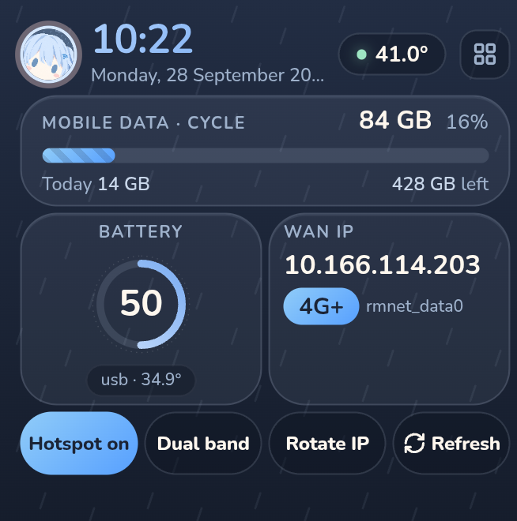

# Ametsuyu Flippost

<p align="center">
  
</p>

Ametsuyu Flippost turns a rooted Samsung Galaxy Z Flip 5 (SM-F731B) into a
dedicated 5G/LTE modem and Wi-Fi 6 hotspot. It ships as a Magisk module with
a local-only Go daemon, a dashboard served from the phone, and a cover-screen
kiosk. It runs in bench thermal mode, which lifts the stock thermal limits and
replaces them with a 70 °C trip. Nothing listens on a public address.

<p align="center">
  
</p>

## Features

- **Wi-Fi 6 hotspot.** The daemon starts the SoftAP the way Samsung Settings
  does, so clients get 802.11ax at 80 MHz, up to 1200 Mbps, rather than the
  802.11n link that stock Android start paths give.
- **Dual-band hotspot.** One SSID on 2.4 GHz and 5 GHz at once, both Wi-Fi 6.
  Toggle it from the kiosk's **Dual band** button or pick the **2.4 + 5 GHz**
  preset band.
- **Home-network auto-toggle.** The hotspot turns off when a network from
  `ssid_whitelist` is in range and back on when you leave. A timed override keeps it on for up to 24
  hours.
- **Hotspot presets.** Save named SSID, passphrase, security, and band sets.
  Presets can switch automatically based on nearby networks.
- **Dashboard.** Data usage against a configurable quota, signal detail,
  battery, per-core CPU, temperature history, connected clients, and an inbox
  for SMS and notifications.
- **Cover-screen kiosk.** Clock, data usage, battery, WAN IP, and one-tap
  hotspot, dual-band, and IP-rotation controls on the 352-pixel Flex Window.
- **Bench thermal mode.** The daemon lifts Android and Samsung thermal
  throttling so the phone runs at full clocks, and enforces its own 70 °C trip
  in their place. It warns at 65 °C. Crossing 70 °C forces a cooldown, and
  you can also start one manually from the dashboard.
- **CPU policy.** Auto, performance, balanced, eco, and off modes. Policy only
  reduces load when the phone runs hot.
- **Alerts.** A self-hosted Telegram bot and a device-local ntfy runner report
  temperature, battery, power, data cap, signal, and hotspot changes.
- **Remote control.** Reach the dashboard, Telegram bot, Discord relay, and
  Apple Shortcuts over your own Tailscale tailnet.

## Design

The dashboard and kiosk share one token set drawn from the logo: a rain-sky
slate ground with faint drizzle, icy blue glass cards, cream text, and a blush
pink accent. Buttons are pills, and the type is the rounded Nunito face, with
system fonts as the fallback. A compiled-in test asserts that both pages use
identical token values. [`DESIGN.md`](DESIGN.md) lists every token.

The kiosk runs a dimmer version of the background because the Flex Window
stays lit whenever the phone is closed. The whole layout also shifts a few
pixels each minute to prevent OLED burn-in.

## Safety

- **Bench thermal mode is on.** With `thermal.bench=true`, the daemon disables
  the thermal zones, zeroes the cooling devices, and lifts Samsung's kernel
  CPU frequency cap. A watchdog re-applies this every 5 seconds.
- **The 70 °C trip is the last line of defense.** When the hottest sensor
  reaches 70 °C, the daemon restores all stock thermal mitigation. It lifts
  the limits again automatically once the phone cools to 55 °C or lower.
  Nothing overrides the trip.
- **Stock mode is one setting away.** Set `thermal.bench=false` to restore
  Samsung's mitigation, a 44 °C warning, and a hard 48 °C cap.

Warning: Bench mode suits battery-less donor hardware on a bench supply. With
a battery installed, sustained heat near 70 °C can swell or damage the cell.
- **Loopback only.** The daemon binds `127.0.0.1` and refuses any other bind
  address. Remote access goes through Tailscale, never a port forward.
- **SMS stays pull-only.** The daemon redacts, rate-limits, and never forwards
  messages. The Telegram bot can pull full SMS text only when you set
  `SMS_READ` in its `.env` file.
- **No modem identity changes.** Nothing writes to the IMEI, baseband, SIM, or
  eSIM, and nothing bypasses carrier provisioning.

Warning: Your carrier can route a public IPv6 prefix to the phone. Any service
bound to `0.0.0.0` or `::` is then reachable from the internet, including ADB
over TCP. Keep the IPv6 firewall in place and add every new port to it. For
details, see [Threat model](docs/threat-model.md).

## Repository layout

| Path | Contents |
| --- | --- |
| `daemon/` | Go root daemon: loopback API, thermal and CPU policy, dashboard, kiosk |
| `magisk/` | Magisk module: `service.sh`, `action.sh`, ntfy runner, packaged daemon and `tether.jar` |
| `helper/` | Cover-screen kiosk APK and root helpers for tethering, Wi-Fi scans, and USB tethering |
| `selfhost/` | Telegram bot, ntfy server, and Discord relay (Docker Compose) |
| `tools/` | Build, packaging, and verification scripts |
| `docs/` | Install, dashboard, alerts, Tailscale, and threat-model guides |
| `schemas/` | OpenAPI and config JSON schemas |

## Get started

You need a rooted Z Flip 5 (SM-F731B) with Magisk, and a computer with `adb`,
Go, and a JDK with the Android build tools.

1. Clone the repository:

   ```sh
   git clone https://github.com/adacch1/ametsuyu-flippost.git
   cd ametsuyu-flippost
   ```

1. Build and install the module by following [Install](docs/install.md).
1. Set up remote access by following [Tailscale](docs/tailscale.md).
1. Open the dashboard as described in [Dashboard](docs/dashboard.md).

For alerts, see [Telegram bot](docs/telegram-bot.md) and [ntfy](docs/ntfy.md).
For the home-network auto-toggle, see [Hotspot auto-toggle](docs/hotspot-auto.md).

### Update the daemon

The module runs a watchdog that restarts the daemon, so a daemon update needs
no reboot. The kernel refuses to overwrite a running binary, so rename it
first:

```sh
bash tools/build-daemon.sh
adb push dist/zflip5-modemd /data/local/tmp/modemd.new
printf '%s\n' \
  'BIN=/data/adb/modules/zflip5_modem/daemon/zflip5-modemd' \
  'mv "$BIN" "$BIN.old"; cp /data/local/tmp/modemd.new "$BIN"' \
  'chmod 0755 "$BIN"; rm "$BIN.old"; pkill -x zflip5-modemd' \
  | adb shell su
```

The watchdog starts the updated daemon within about 10 seconds.

## Disclaimer

Ametsuyu Flippost targets one device and one owner's workflow, and it's
published for reference. Rooting trips Knox, which disables Samsung Pay and
Secure Folder, and voids the warranty. Use it at your own risk.

## License

MIT. See [LICENSE](LICENSE).
