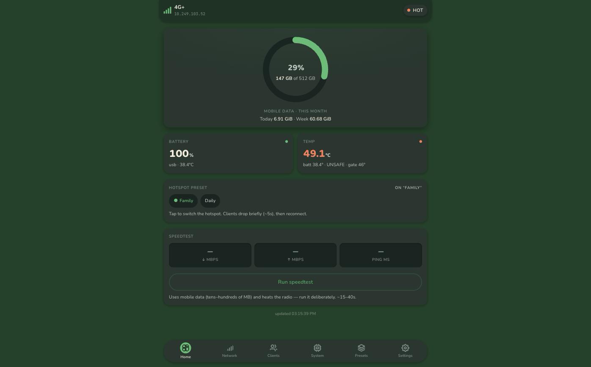

# zflip5-modem-module

A rooted Samsung Galaxy Z Flip 5 (SM-F731B) turned into a dedicated 5G/LTE modem and Wi-Fi hotspot — with a proper admin dashboard, thermal safety you can't accidentally disable, and remote control from an iPhone (Apple Shortcuts) or Discord.

A small local-only root service (Go) reports network, tethering, thermal, battery, and recent SMS state, can auto-switch hotspot presets by which Wi-Fi network is in range, and can safely prefer/recover 5G — all **without** ever bypassing thermal protection.

   
  

## Why

Old phones make great dedicated modems — always-on cellular radio, its own battery, a screen for status at a glance. This project turns a Z Flip 5 into exactly that: a controllable hotspot with real safety rails (it will not let itself overheat) and a dashboard that's actually pleasant to check.

## Features

- **Live dashboard** — data usage ring, signal, battery, per-core CPU, thermal state, connected clients, all served from the phone itself, no cloud dependency.
- **Hotspot presets** — save named SoftAP configs (SSID/pass/band), auto-switch by which Wi-Fi network is currently in range.
- **802.11ax hotspot** — full Wi-Fi 6 SoftAP (not the 300 Mbps 802.11n Android normally ships), started the same way Samsung's own Settings toggle does.
- **USB tethering** — toggle and check status alongside Wi-Fi tethering.
- **Thermal gate that's actually a gate** — hard-capped at 48°C server-side; the UI can adjust the warn/gate thresholds within that cap, never past it.
- **CPU policy** — auto/performance/balanced/eco/off, reduces load automatically when the device is running hot.
- **SMS, pull-only** — redacted by default, owner-only, rate-limited, never auto-forwarded.
- **Remote control** — Apple Shortcuts and a self-hosted Discord bot, both over Tailscale; no public endpoint.
- **Themeable dashboard** — Green/Ivory/Black solid color themes, plus a background photo you can pick from your device (always kept legible with an automatic dark or light scrim depending on theme). Served as a single self-contained page with no build step, no CDN, no external fonts.
- **No token to babysit** — the daemon generates its own scoped tokens on first boot and hands them to the dashboard automatically (open reads + open control on by default), so opening the page — from the phone's own kiosk or a browser on your tailnet — just works. Flip `open_reads`/`open_control` off in Settings if you'd rather require the token explicitly.

## Recommended: put it behind Tailscale

The phone sits behind carrier CGNAT, so there's no public inbound path anyway — remote access is a private mesh VPN, never a port-forward. The daemon binds `127.0.0.1` only; the module can run **userspace** `tailscaled` (no TUN, no root network changes) and expose just that loopback port to your tailnet with `tailscale serve`. That's how the iPhone Shortcuts and Discord relay reach it, and it's the intended way to open the dashboard from a desktop browser (like the screenshot above) instead of USB `adb forward`. See [`docs/tailscale.md`](docs/tailscale.md) for the one-time setup (auth key, `ingress.mode`).

## Safety guarantees (non-negotiable)

- No disabling or bypassing Samsung/Android thermal mitigation. Android thermal status is a hard safety gate; 44°C is a warning threshold, 48°C is a hard cap enforced server-side regardless of what the UI is told to do.
- No public API. The daemon binds `127.0.0.1` only; remote access is exclusively through your own private Tailscale tunnel, never a port-forward. Reads/writes default to tokenless *within that private tunnel* for convenience — real bearer tokens still exist underneath and can be required again any time from Settings.
- SMS is pull-only, redacted by default, owner-only, and rate-limited. Never auto-forwarded.
- No IMEI / baseband / SIM / eSIM modification and no carrier-provisioning bypass.

## Status

Implemented and running on-device. The Go daemon (`daemon/`), Magisk module (`magisk/`), WebView cover-screen kiosk (`helper/`), and self-hosted ntfy + Discord bot (`selfhost/`) are all built and deployed.

## Layout

| Path | Purpose |
| --- | --- |
| `daemon/` | Go root daemon: loopback API, thermal/CPU policy, served dashboard |
| `magisk/` | Magisk module: `service.sh`, `action.sh`, packaged daemon + `tether.jar` |
| `helper/` | WebView cover-screen kiosk APK + root tether/wifi-scan/USB-tether helpers |
| `selfhost/` | Self-hosted ntfy + Discord Gateway bot (docker-compose) |
| `tools/` | Build, packaging, and verification scripts |
| `docs/` | Architecture, threat model, install, safety, troubleshooting |
| `schemas/` | API (OpenAPI) and config JSON schemas |

## Getting started

You'll need a rooted Z Flip 5 (SM-F731B) with Magisk, and a host with `adb` + Go. Full build/install/update steps are in [`docs/install.md`](docs/install.md); once installed, open the dashboard — over Tailscale (recommended, see above) or loopback via `adb forward` for local testing — see [`docs/dashboard.md`](docs/dashboard.md).

## Disclaimer

This is a personal hardware project built for one specific device and one owner's workflow, published for reference. Rooting trips Knox (Samsung Pay / Secure Folder stop working) and voids your warranty. Use at your own risk; nothing here is a general-purpose product.

## License

MIT — see [LICENSE](LICENSE).
