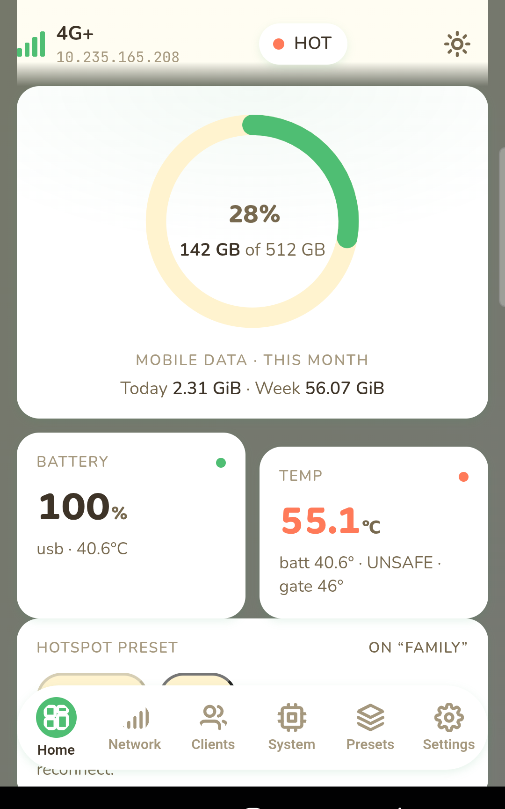

# zflip5-modem-module

A rooted Samsung Galaxy Z Flip 5 (SM-F731B) turned into a dedicated 5G/LTE modem and Wi-Fi hotspot — with a proper admin dashboard, thermal safety you can't accidentally disable, and remote control from an iPhone (Apple Shortcuts) or Discord.

A small local-only root service (Go) reports network, tethering, thermal, battery, and recent SMS state, can auto-switch hotspot presets by which Wi-Fi network is in range, and can safely prefer/recover 5G — all **without** ever bypassing thermal protection.

  

## Why

Old phones make great dedicated modems — always-on cellular radio, its own battery, a screen for status at a glance. This project turns a Z Flip 5 into exactly that: a controllable hotspot with real safety rails (it will not let itself overheat) and a dashboard that's actually pleasant to check.

## Features

- **Live dashboard** — data usage ring, signal, battery, per-core CPU, thermal state, connected clients, all served from the phone itself, no cloud dependency.
- **Hotspot presets** — save named SoftAP configs (SSID/pass/band), auto-switch by which Wi-Fi network is currently in range.
- **802.11ax hotspot** — full Wi-Fi 6 SoftAP (not the 300 Mbps 802.11n Android normally ships), started the same way Samsung's own Settings toggle does.
- **USB tethering** — toggle and check status alongside Wi-Fi tethering.
- **Thermal gate that's actually a gate** — hard-capped at 48°C server-side; the UI can adjust the warn/gate thresholds within that cap, never past it.
- **CPU policy** — auto/performance/balanced/eco/off, reduces load automatically when the device is running hot.
- **SMS, pull-only** — redacted by default, owner-only, rate-limited, never auto-forwarded.
- **Remote control** — Apple Shortcuts and a self-hosted Discord bot, both over Tailscale; no public endpoint.
- **Themeable dashboard** — light/dark, a background you can pick or upload a photo for, all served as a single self-contained page with no build step.

## Safety guarantees (non-negotiable)

- No disabling or bypassing Samsung/Android thermal mitigation. Android thermal status is a hard safety gate; 44°C is a warning threshold, 48°C is a hard cap enforced server-side regardless of what the UI is told to do.
- No public/unauthenticated API. The daemon binds `127.0.0.1` by default; remote access only through an explicit private tunnel (Tailscale).
- SMS is pull-only, redacted by default, owner-only, and rate-limited. Never auto-forwarded.
- No IMEI / baseband / SIM / eSIM modification and no carrier-provisioning bypass.

## Status

Implemented and running on-device. The Go daemon (`daemon/`), Magisk module (`magisk/`), WebView cover-screen kiosk (`helper/`), and self-hosted ntfy + Discord bot (`selfhost/`) are all built and deployed.

## Layout

| Path | Purpose |
| --- | --- |
| `daemon/` | Go root daemon: loopback API, thermal/CPU policy, served dashboard |
| `magisk/` | Magisk module: `service.sh`, `action.sh`, packaged daemon + `tether.jar` |
| `helper/` | WebView cover-screen kiosk APK + root tether/wifi-scan/USB-tether helpers |
| `selfhost/` | Self-hosted ntfy + Discord Gateway bot (docker-compose) |
| `tools/` | Build, packaging, and verification scripts |
| `docs/` | Architecture, threat model, install, safety, troubleshooting |
| `schemas/` | API (OpenAPI) and config JSON schemas |

## Getting started

You'll need a rooted Z Flip 5 (SM-F731B) with Magisk, and a host with `adb` + Go. Full build/install/update steps are in [`docs/install.md`](docs/install.md); once installed, point a browser at the daemon (loopback via `adb forward`, or your tailnet) — see [`docs/dashboard.md`](docs/dashboard.md).

## Disclaimer

This is a personal hardware project built for one specific device and one owner's workflow, published for reference. Rooting trips Knox (Samsung Pay / Secure Folder stop working) and voids your warranty. Use at your own risk; nothing here is a general-purpose product.

## License

MIT — see [LICENSE](LICENSE).
