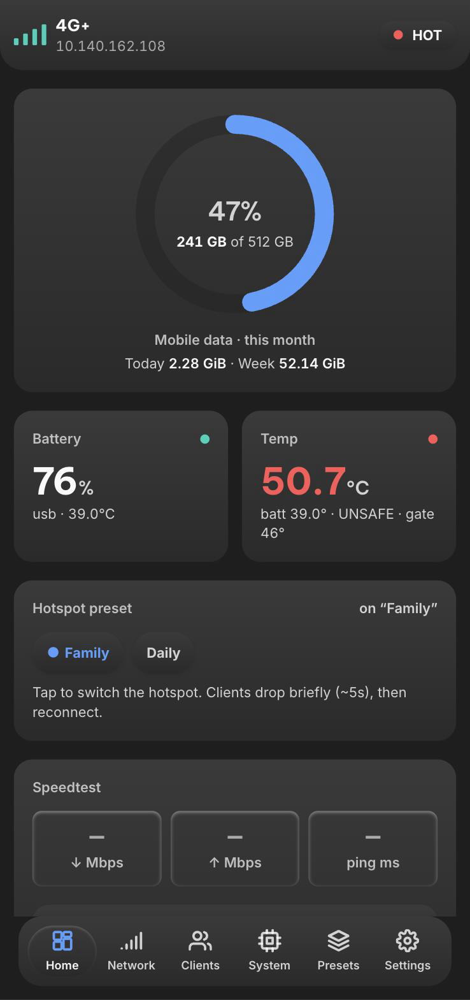
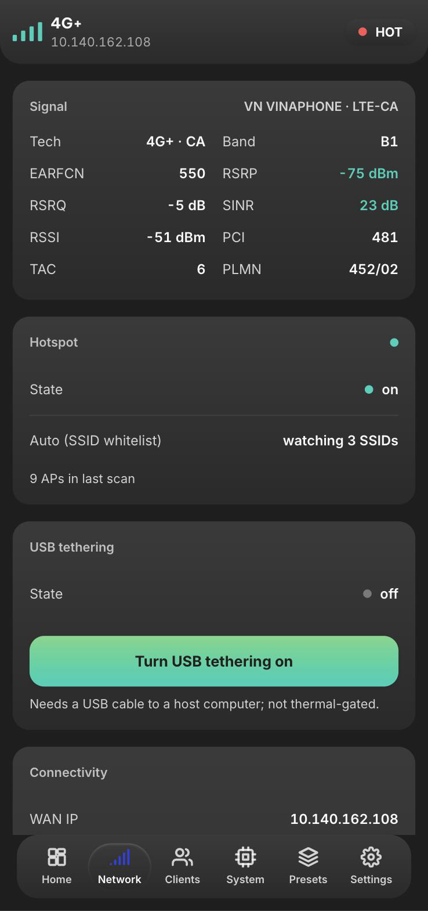
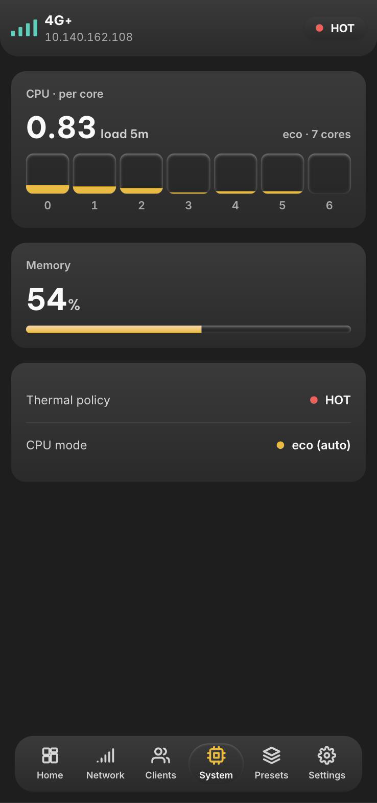

# zflip5-modem-module

A rooted Samsung Galaxy Z Flip 5 (SM-F731B) turned into a dedicated 5G/LTE modem and Wi-Fi hotspot — with an admin dashboard, real thermal safety rails, and remote control from an iPhone (Apple Shortcuts) or Discord.

A small local-only root service (Go) reports network, tethering, thermal, battery, and recent SMS state, auto-switches hotspot presets by which Wi-Fi network is in range, and manages a thermally gated 5G preference. Normal mode never bypasses thermal protection; a single explicit opt-in (`thermal.bench`) exists for battery-less donor hardware only.

<p align="center">
  
  
  
</p>

<p align="center"><em>Live screens from the device. Note the System tab: the phone is genuinely hot, so the CPU policy has dropped to <strong>eco</strong> and parked a core — 7 of 8 online.</em></p>

## Why

Old phones make great dedicated modems — always-on cellular radio, its own battery, a screen for status at a glance. This project turns a Z Flip 5 into exactly that: a controllable hotspot with real safety rails (it will not let itself overheat in normal mode) and a dashboard that's pleasant to check.

## Features

- **Live dashboard** — data usage ring, signal, battery, per-core CPU, thermal state, connected clients, all served from the phone itself, no cloud dependency.
- **Hotspot presets** — save named SoftAP configs (SSID/pass/band), auto-switch by which Wi-Fi network is currently in range.
- **802.11ax hotspot** — full Wi-Fi 6 SoftAP (not the 300 Mbps 802.11n Android normally ships), started the same way Samsung's own Settings toggle does.
- **USB tethering** — toggle and check status alongside Wi-Fi tethering.
- **Thermal gate that's actually a gate** — 44°C warning / 48°C hard cap enforced server-side in normal mode; the UI can retune within that cap, never past it, and never to "off".
- **CPU policy** — auto/performance/balanced/eco/off, reduces load automatically when the device is running hot.
- **SMS, pull-only** — redacted by default, owner-only, rate-limited, never auto-forwarded.
- **Remote control** — Apple Shortcuts and a self-hosted Discord bot, both over Tailscale; no public endpoint.
- **No token to babysit** — the daemon generates its own scoped tokens on first boot and hands them to the dashboard automatically (open reads + open control on by default), so opening the page — from the phone's own kiosk or a browser on your tailnet — just works. Flip `open_reads`/`open_control` off in Settings if you'd rather require the token explicitly.

## Bench mode — battery-less donor hardware only

For a donor device with **no battery**, on a bench supply, in a monitored lab. Everything else should keep `thermal.bench` off.

Enable it once:

```sh
# config.json
"thermal": { "warn_c": 44, "gate_c": 46, "fail_closed": true, "bench": true }
```

or at runtime (radio-control token): `POST /v1/thermal/bench {"enabled":true}`.

While active:

- Thermal zones are disabled, thermal HALs (`thermal-engine`, `sec-thermal-1-0`) stopped, cooling devices zeroed.
- Samsung's kernel `cpufreq_limit` ceiling is lifted to the hardware max, SIOP is pinned to normal, and voltage-based downclocking is disabled.
- Reversible net tuning is applied: `cubic` TCP, MTU probing, TCP Fast Open, ECN, bigger buffers, and `fq_codel` on both the SoftAP (`swlan0`) and WWAN (`rmnet_data0`) interfaces.
- The app gate lifts to 65°C warn / 70°C gate.

Safety still applies. At 70°C the trip restores **all** stock mitigation; the daemon re-arms automatically once the device cools to ≤55°C, so it runs hands-off. Disabling bench (or a trip) restores every original value. Boot persistence is covered: `config.json` survives reboot, `magisk/sepolicy.rule` carries the scoped SELinux rule, and the daemon re-applies bench on start.

Limits: modem firmware-internal thermal logic is not reachable from Android userspace, and Wi-Fi AP capability (10 clients, 5 GHz ch149 @ 160 MHz on this device) is fixed by the driver/firmware.

## The dashboard

One self-contained page: no build step, no CDN, no framework, no external asset beyond two webfonts. Six tabs — Home, Network, Clients, System, Presets, Settings — served straight off the phone's loopback.

It follows a measured dark design system: every raised surface is a vertical gradient over a single flat `#1e1e1e` page, depth comes from lighting (shadows and inset bevels) rather than texture, and each tab binds one of seven named accent gradients — so the whole screen recolours per section from two CSS variables.

Accessibility is checked rather than assumed: every text node clears WCAG AA contrast, controls are 44px touch targets, tabs are real `tablist`/`tabpanel` semantics with focus moved into the panel on switch, and the meters animate with `transform` rather than layout properties so the poll loop doesn't reflow the page.

Typography is **Be Vietnam Pro** + **Inter**, chosen because both ship a `vietnamese` subset — a face without one drops diacritics to a system fallback and breaks mid-word.

## Recommended: put it behind Tailscale

The phone sits behind carrier CGNAT, so there's no public inbound path anyway — remote access is a private mesh VPN, never a port-forward. The daemon binds `127.0.0.1` only; the module can run **userspace** `tailscaled` (no TUN, no root network changes) and expose just that loopback port to your tailnet with `tailscale serve`. That's how the iPhone Shortcuts and Discord relay reach it, and it's the intended way to open the dashboard from a desktop browser instead of USB `adb forward`. See [`docs/tailscale.md`](docs/tailscale.md) for the one-time setup (auth key, `ingress.mode`).

> **Check what else is listening.** The carrier may route a public IPv6 prefix to the phone, in which case anything bound to `0.0.0.0`/`::` is reachable from the open internet even though IPv4 is CGNAT'd. The daemon itself is loopback-only and unaffected, but adb-over-TCP and any side service you add are not. `tools/security-check.sh --device` asserts the daemon's bind; verify the rest yourself before leaving them up.

## Safety guarantees (non-negotiable)

- Normal mode never disables or bypasses Samsung/Android thermal mitigation. 44°C is a warning threshold and 48°C is a hard cap enforced server-side. The only exception is `thermal.bench=true`, an explicit opt-in for **battery-less donor hardware** on a bench supply: it suspends OS thermal mitigation (zones, HALs, Samsung kernel `cpufreq_limit`) and lifts the gate to 70°C, with a hard 70°C trip that restores protection and auto re-arms at ≤55°C. It stays off unless you enable it.
- No public API. The daemon binds `127.0.0.1` only; remote access is exclusively through your own private Tailscale tunnel, never a port-forward. Reads/writes default to tokenless *within that private tunnel* for convenience — real bearer tokens still exist underneath and can be required again any time from Settings.
- SMS is pull-only, redacted by default, owner-only, and rate-limited. Never auto-forwarded.
- No IMEI / baseband / SIM / eSIM modification and no carrier-provisioning bypass.

## Status

Implemented and running on-device. The Go daemon (`daemon/`), Magisk module (`magisk/`), WebView cover-screen kiosk (`helper/`), and self-hosted ntfy + Discord bot (`selfhost/`) are all built and deployed.

## Layout

| Path | Purpose |
| --- | --- |
| `daemon/` | Go root daemon: loopback API, thermal/CPU policy, bench mode, served dashboard |
| `magisk/` | Magisk module: `service.sh`, `action.sh`, `sepolicy.rule`, packaged daemon + `tether.jar` |
| `helper/` | WebView cover-screen kiosk APK + root tether/wifi-scan/USB-tether helpers |
| `selfhost/` | Self-hosted ntfy + Discord Gateway bot (docker-compose) |
| `tools/` | Build, packaging, and verification scripts |
| `docs/` | Architecture, threat model, install, safety, troubleshooting |
| `schemas/` | API (OpenAPI) and config JSON schemas |

## Getting started

You'll need a rooted Z Flip 5 (SM-F731B) with Magisk, and a host with `adb` + Go. Full build/install/update steps are in [`docs/install.md`](docs/install.md); once installed, open the dashboard — over Tailscale (recommended, see above) or loopback via `adb forward` for local testing — see [`docs/dashboard.md`](docs/dashboard.md).

Updating just the daemon does not need a reboot. The module's `service.sh` runs a watchdog, so replacing the binary and killing the process is enough — note that a *running* executable can't be overwritten in place (`ETXTBSY`), so rename it first:

```sh
bash tools/build-daemon.sh                       # -> dist/zflip5-modemd (static arm64)
adb push dist/zflip5-modemd /data/local/tmp/modemd.new
adb shell su -c 'BIN=/data/adb/modules/zflip5_modem/daemon/zflip5-modemd; \
  mv "$BIN" "$BIN.old" && cp /data/local/tmp/modemd.new "$BIN" && chmod 0755 "$BIN" && \
  kill $(ps -A -o PID,ARGS | grep "[z]flip5-modemd --config" | awk "{print \$1}" | tail -1)'
# watchdog respawns within ~10s
```

## Disclaimer

This is a personal hardware project built for one specific device and one owner's workflow, published for reference. Rooting trips Knox (Samsung Pay / Secure Folder stop working) and voids your warranty. Use at your own risk; nothing here is a general-purpose product.

## License

MIT — see [LICENSE](LICENSE).
